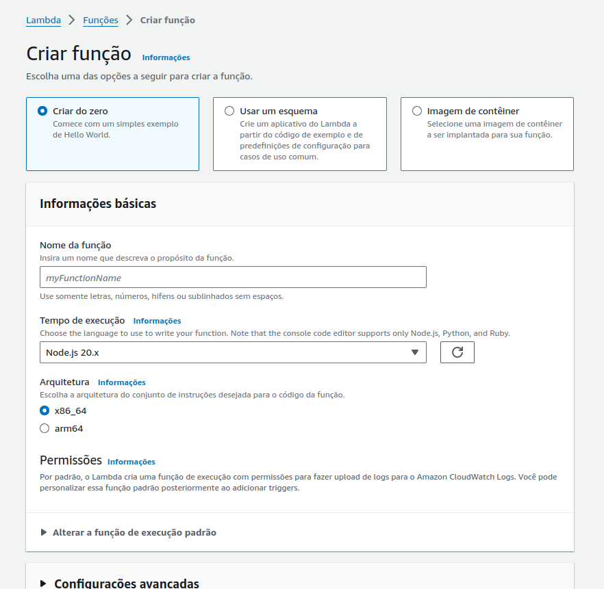
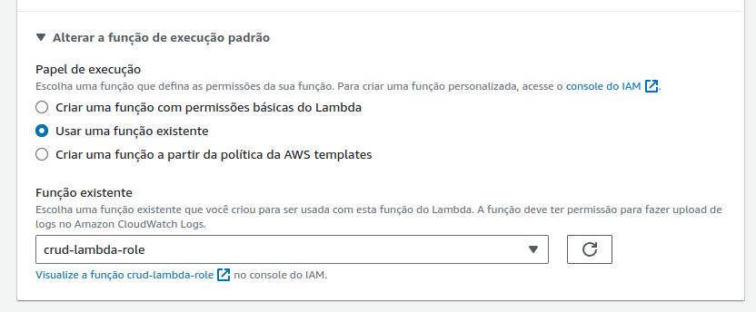
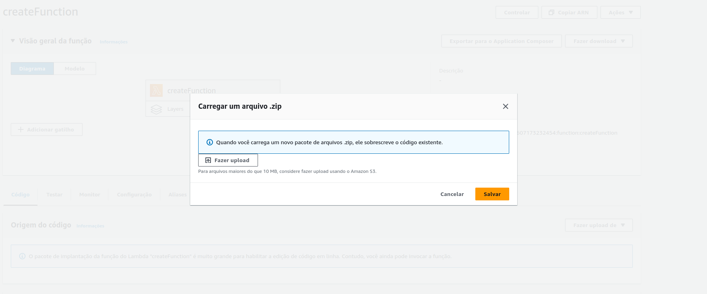
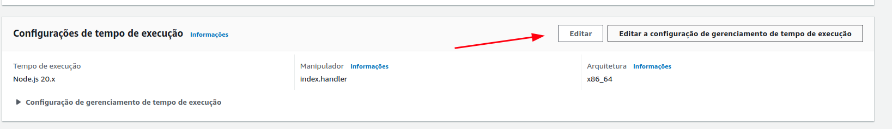
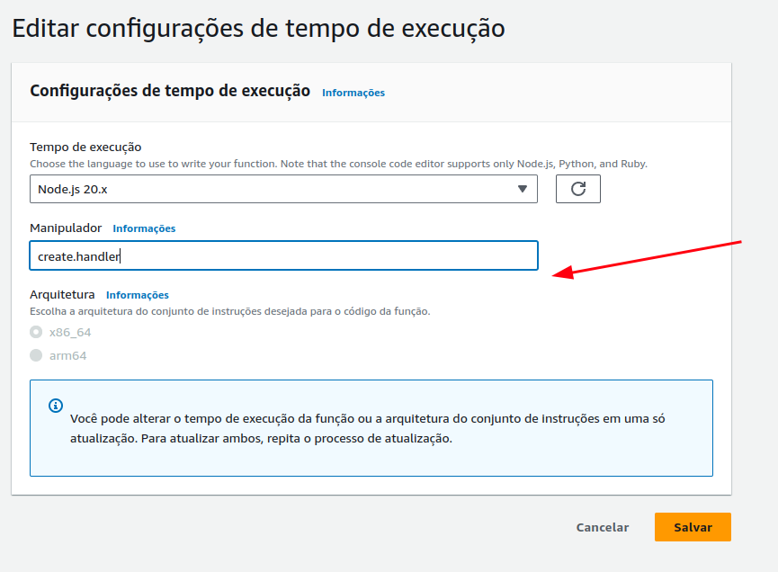
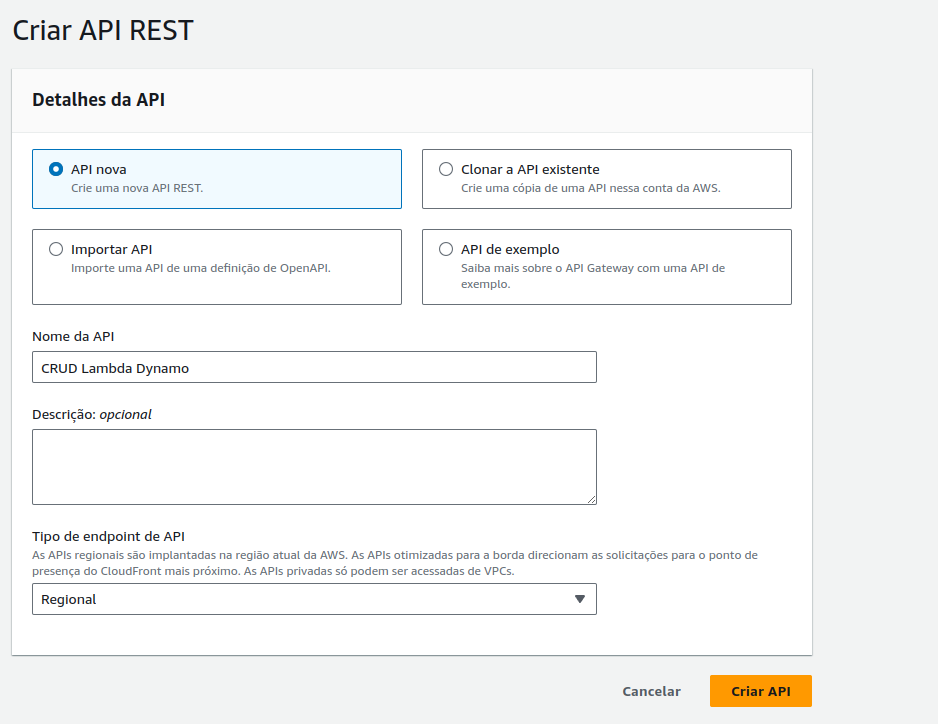
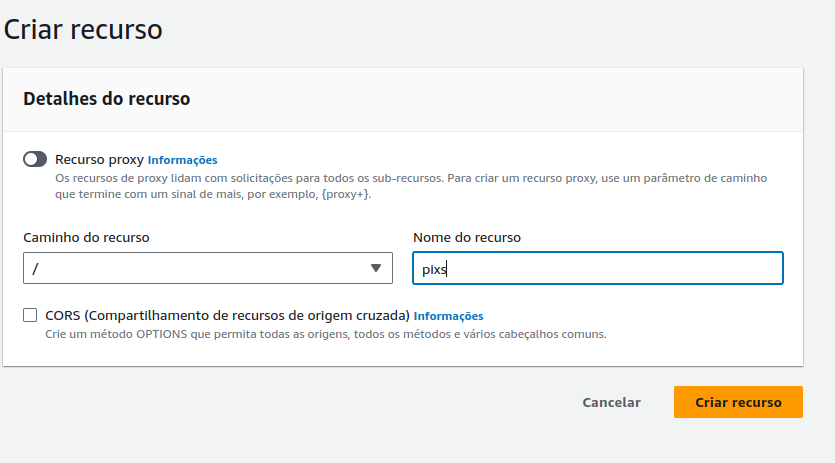
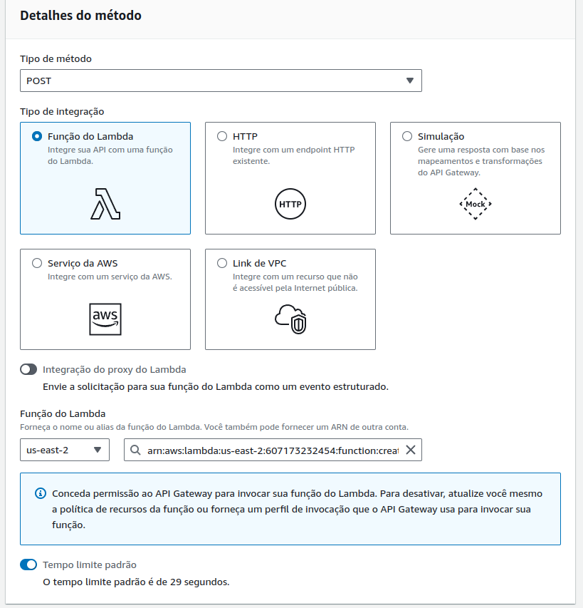
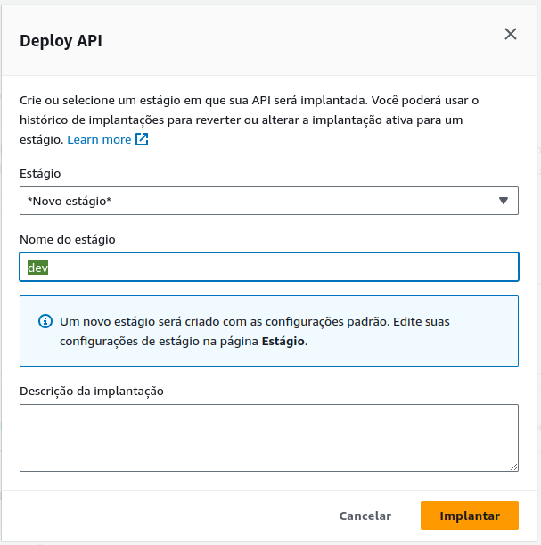

## Introdução

Este projeto implementa um CRUD utilizando AWS Lambda e DynamoDB.

## Requisitos

-   AWS CLI configurado
-   Node.js instalado

## Configuração

1. Clone o repositório:
    ```sh
    git clone <url-do-repositorio>
    cd <nome-do-diretorio>
    ```
2. Instale as dependências:
    ```sh
    npm install
    ```
3. Zip os arquivos:
    ```sh
    zip -r function.zip create.js read.js update.js delete.js package.json node_modules
    ```
4. Crie e configure as funções Lambda e API Gateway no console da AWS conforme as instruções abaixo.
4.1 Criar Funções Lambda
-   No painel de console da AWS crie uma função Lambda:

-   Associe a role:

-   Faça o upload do arquivo .zip

-   Em **Handler**, especifique o arquivo e a função a ser usada, ex `create.handler`.


4.2 Configurar API Gateway
1. Acesse o Console do API Gateway [aqui](https://console.aws.amazon.com/apigateway)
2. Criar uma nova API REST:
   - Clique em **Create API**.
   - Escolha **REST API**.
   - Selecione **New API** e dê um nome para sua API.
   - Clique em **Create API**.
   
3. Criar Métodos para Cada Operação:
    - Para a operação de criação (Create):
        - Selecione **Actions** > **Create Resource**.
        - Dê um nome ao recurso, como `pixs`.

-   Selecione o recurso criado e clique em **Actions** > **Create Method.**
-   Escolha `POST` e clique no ícone de check.
-   Selecione **Lambda Function** como tipo de integração.
-   Insira o nome da função Lambda (`createFunction`) e clique em **Save**.
-   Conceda permissão ao API Gateway para invocar sua função Lambda se solicitado.

-   Repita os passos para os outros métodos:
-   `GET` para leitura (`readFunction`).
-   `PUT` para atualização (`updateFunction`).
-   `DELETE` para exclusão (`deleteFunction`).
4. Implantar a API:
    - Clique em **Actions** > **Deploy API**.
    - Crie uma nova **Stage** (por exemplo, `dev`) e clique em **Deploy**.

5. Obtenha a URL da API:
    - Após a implantação, você receberá uma URL base para a sua API. Essa URL será usada para testar as funções Lambda.

## Testando

Utilize o Rest Client Extension (VSCODE) para enviar requisições HTTP, definidas no arquivo: api-requests.http, às funções Lambda configuradas.

## Decisões Técnicas

-   Utilizei o Node.js devido à sua eficiência e suporte robusto no AWS Lambda.
-   Utilizei múltiplos scripts para cada operação CRUD por diversas razões
    -   Separação de Preocupações: Cada arquivo lida com uma única responsabilidade, o que facilita a leitura e manutenção do código. Isso também permite isolar problemas e bugs em uma parte específica do código.
    -   Facilidade de Teste: Testar funcionalidades individuais pode ser mais direto, uma vez que cada função pode ser invocada e testada separadamente.
    -   Escalabilidade de Equipe: Em equipes maiores, diferentes desenvolvedores podem trabalhar em diferentes partes do CRUD simultaneamente sem conflitos.
    -   Desempenho: Cada função Lambda é invocada de forma independente, possivelmente resultando em menor tempo de execução e menor uso de memória, pois apenas o código necessário é carregado.
    -   Gerenciamento de Permissões: É possível atribuir permissões mais específicas a cada função Lambda, aumentando a segurança ao limitar o acesso de cada função apenas às operações que ela deve realizar.

## Autor

Leonardo Zanin

## Licença

MIT
